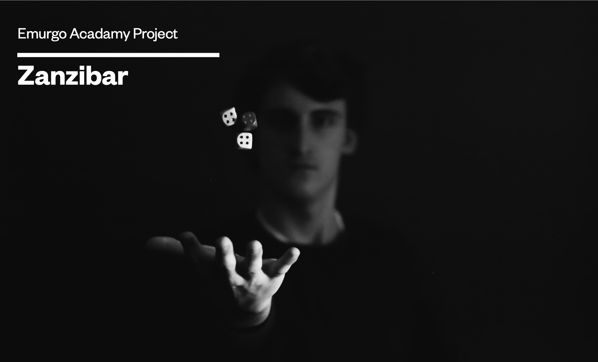

**Table of contents**

- [Zanzibar](#Zanzibar)
- [What we need to play the Zanzibar ?](#What-we-need-to-play-the-Zanzibar-?)
- [How do you play the Zanzibar ?](#How-do-you-play-the-Zanzibar-?)
- [How to score ?](#How-to-score-?)
- [Token distribution](#Token-distribution)
- [Getting Started](#Getting-Started)
- [Game Info](#Game-Info)

# Zanzibar
Zanzibar, better known as 421 in french speaking countries, is a popular dice game, and is often played in bars, especially in France but also in Quebec.

# What we need to play the Zanzibar ?

- Two or more players
- Three six-sided dice
- Counter like token or chips …

# How do you play the Zanzibar ?

The first player may roll the dice up to three times in an attempt to get as high a score as possible. (See How do you score? below.) They may stop rolling after the first or second roll if they wish.
The other players, in turn, then try to roll a higher score in the same number or fewer rolls than the first player.
Once all players have had a turn, the player with the lowest score receives a number of token from the other players. The number of token they receive depends on the hand of the other players.

# How to score ?

The highest ranking combinations are shown in descending order:

- 4,5,6 - Zanzibar
- 1,1,1
- 2,2,2
- 3,3,3
- 4,4,4
- 5,5,5
- 6,6,6
- 1,2,3

All other combinations rank as a sum of the three dice added together:

- 1 = 100 points
- 6 = 60 points
- 2 = 2 points
- 3 = 3 points
- 4 = 4 points
- 5 = 5 points

# Token distribution

- 1 token if the player score a points total

- 2 token if the player score the special combination 1,2,3

- 3 token if the player has a combination (Three equal number)

- 5 token if the player has the combination 4,5,6 (Zanzibar)

# Getting Started

```consol
git clone https://github.com/attadje/zanzibar.git
cd zanzibar
cabal build
cabal run
```

# Game Info

Start by filling in:

- The number of players (>=2)
- The number of token to distribut to each player
- The name of the players

Then, before starting the game, all players will roll the dice once and the player with the highest score will roll the dice first in round 1.
